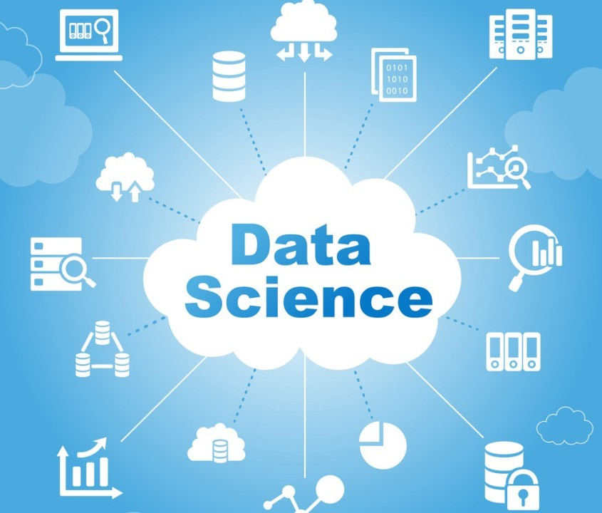

# 					Data Science Projects

Welcome to my Data Science repository.

This repository contains my learning material,datasets,projects,practical notebooks and implementation covering the complete Data Science workflow.

### Objectives

The main objective of his repository are:

* Learn Data Science from fundamentals to advance concepts.
* Practice Python for Data Science.
* Understand data preporcessing and exploratory data analysis.
* Implement machine learning algorithms.
* Build regression,classification,clustering models.
* Work with rel-world datasets.
* Perform model evaluation and optimization.
* Build end-end Data Science projects.
* Devolope practical skills for Data Analyst and Data Science roles.

#### Technology and Tools

##### Programing

* Python
* SQL

##### Python Libraries

* Numpy
* Pandas
* Matplotlib
* Seaborn
* Scikit-learn
* Statsmodels

##### Machine Learning

* Linear Regression
* Logistic Regression
* KNN
* Decision Tree
* Random Forest
* Gradient Boosting
* SVM
* DBSCAN
* Hierarchical Clustering
* K-means

##### Data Visualization

* Matplotlib
* Seaborn
* Power BI

##### Databases

* PostgreSQL
* MySQL

##### Developement Tools

* Jupyter Notebook
* VS Code
* Anaconda
* Git & GitHub

<wbr>

<wbr>
